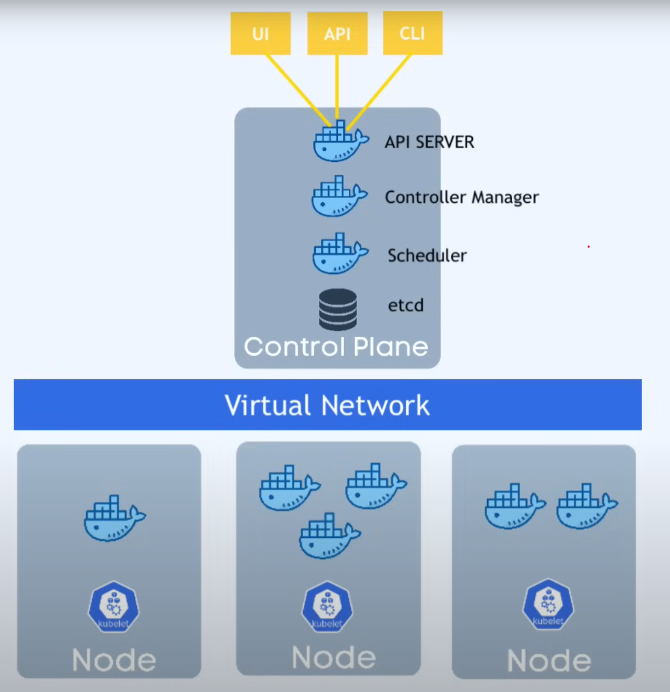

# Kubernetes Basics

Source: https://www.youtube.com/watch?v=s_o8dwzRlu4

Is a container orchestration tool that solve the following problems:

- High availability or no downtime
- Scalability or high performance
- Disaster recovery

## Summary:
- Nodes - physical or virtual machines (resources available).
- Pods - smallest unit in Kubernetes, can contain one or more containers (usally a single container, and are like a container for containers).
- Services - since pods are ephemeral (their ip address can change when they are restarted), services are used to expose pods since they have a stable ip address. A service can be associated to multiple pods.
    - Internal services - used for things like databases
    - External services - used for things like applications
    - Service also provides load balancing
- Ingress - Request made to services are done to ingress and forward to the actual service
- ConfigMaps - configurations of the applications
- Secrets - configurations of the application that need to be hidden
- Deployments - manage the lifecycle of pods. Specifies how many pods of each services, how to scale, etc
- StatefulSet - for statefull apps (like database), to specifie how to scale the number of pods avoindingg concurrency issues

## Kubernetes cluster architecture

Composed by a **master node** and **worker nodes**.

Each **worker node** is composed by:
- Kubelet - is a kubernetes process that make it possible for the cluster to communicate with the node and execute tasks on the node (like running an application).
- Pods - is like a container of containers (usually only one)
- Virtual Network

The **master node** is composed by:
- API Server - this is a container that is the entrypoint to the cluster (UI's, CLI's or other API's can use it to interact with the cluster).
- Controller Manager - keeps track of whats happening in the cluster (like a container died and need to be restarted).
- Scheduler - Intelligent process that decides in which nodes the next pod will be deployed base on the resource available on the cluster.
- etcd - is a key value storage that holds the current state of the kubernetes cluster (has the configuration data and status data of each node and container)
